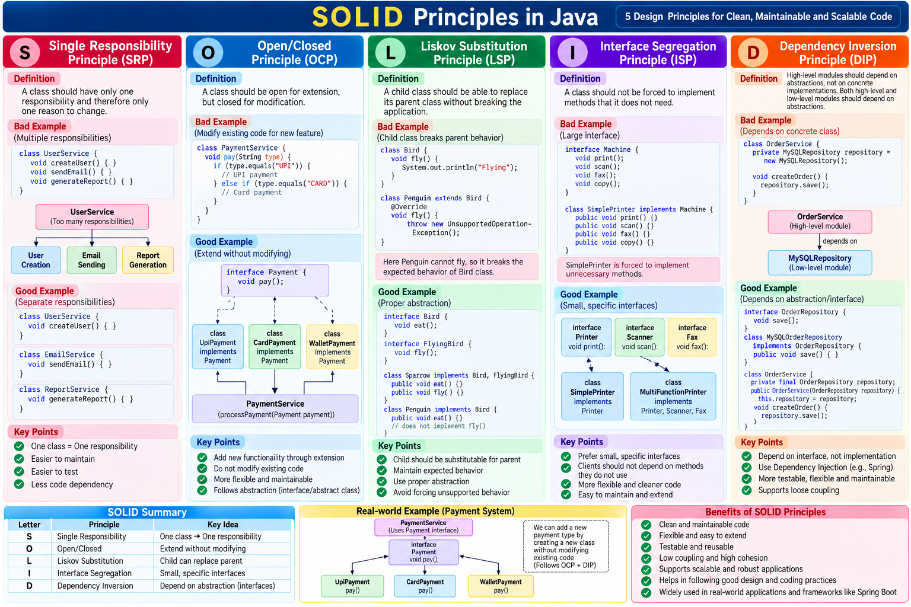

# SOLID Principles — Detailed Java Interview Explanation

**SOLID** is a set of **5 Object-Oriented Design Principles** introduced/popularized by Robert C. Martin (Uncle Bob). These principles help us write code that is **clean, maintainable, flexible, reusable, testable, and loosely coupled**.

---

# 1. S — Single Responsibility Principle (SRP)

### Definition

**English:**
A class should have **one responsibility** and therefore only **one reason to change**.

**Hindi:**
एक class की **एक मुख्य responsibility** होनी चाहिए और उस class के change होने का ideally एक ही primary reason होना चाहिए।

### ❌ Bad Example

Suppose we have a `UserService`:

```java
public class UserService {

    public void createUser(User user) {
        // Save user
    }

    public void sendEmail(User user) {
        // Send email
    }

    public void generateReport() {
        // Generate report
    }
}
```

Here `UserService` is doing three different jobs:

```text
UserService
   |
   +-- User creation
   +-- Email sending
   +-- Report generation
```

If email logic changes, `UserService` changes.

If report logic changes, `UserService` changes.

If user creation changes, `UserService` changes.

So the class has **multiple reasons to change**.

---

### ✅ Good Example

Separate responsibilities:

```java
public class UserService {

    public void createUser(User user) {
        // Create user
    }
}
```

```java
public class EmailService {

    public void sendEmail(User user) {
        // Send email
    }
}
```

```java
public class ReportService {

    public void generateReport() {
        // Generate report
    }
}
```

Now:

```text
UserService
    ↓
User Management

EmailService
    ↓
Email Management

ReportService
    ↓
Report Management
```

### Benefits

* Easier maintenance
* Easier testing
* Less code dependency
* Better readability
* Easier changes

### Interview Answer

> **SRP means a class should have one responsibility and one reason to change.**

---

# 2. O — Open/Closed Principle (OCP)

### Definition

**English:**
Software entities should be **open for extension but closed for modification**.

**Hindi:**
Existing code को बार-बार modify किए बिना नई functionality add करने में सक्षम होना चाहिए।

---

## ❌ Bad Example

Suppose we have different payment types:

```java
public class PaymentService {

    public void pay(String type) {

        if (type.equals("UPI")) {
            // UPI payment
        }
        else if (type.equals("CARD")) {
            // Card payment
        }
        else if (type.equals("NETBANKING")) {
            // Net banking
        }
    }
}
```

Tomorrow we add:

```text
WALLET
EMI
BNPL
CRYPTO
```

We have to keep modifying `PaymentService`.

This violates OCP.

---

## ✅ Good Example

Create an abstraction:

```java
public interface Payment {

    void pay();
}
```

UPI:

```java
public class UpiPayment implements Payment {

    @Override
    public void pay() {
        System.out.println("UPI Payment");
    }
}
```

Card:

```java
public class CardPayment implements Payment {

    @Override
    public void pay() {
        System.out.println("Card Payment");
    }
}
```

Service:

```java
public class PaymentService {

    public void processPayment(Payment payment) {
        payment.pay();
    }
}
```

Now if we need Wallet:

```java
public class WalletPayment implements Payment {

    @Override
    public void pay() {
        System.out.println("Wallet Payment");
    }
}
```

We **extend** the system without modifying the existing `PaymentService`.

### Flow

```text
              Payment Interface
                     |
        +------------+------------+
        |            |            |
       UPI          Card        Wallet
     Payment       Payment       Payment
```

### Interview Answer

> **OCP means existing code should be closed for modification but open for extension. We should add new functionality through abstraction rather than repeatedly changing existing code.**

---

# 3. L — Liskov Substitution Principle (LSP)

### Definition

**English:**
Objects of a child class should be replaceable for objects of the parent class **without breaking the expected behavior of the application**.

**Hindi:**
Child class का object parent class के object की जगह safely use किया जा सके और application का expected behavior break नहीं होना चाहिए।

---

## Simple Example

```java
class Bird {

    public void eat() {
        System.out.println("Eating");
    }
}
```

```java
class Sparrow extends Bird {

    public void fly() {
        System.out.println("Flying");
    }
}
```

This is fine:

```java
Bird bird = new Sparrow();

bird.eat();
```

`Sparrow` can substitute `Bird`.

---

## ❌ Common LSP Problem

Consider:

```java
class Bird {

    public void fly() {
        System.out.println("Flying");
    }
}
```

Now:

```java
class Sparrow extends Bird {
}
```

Sparrow can fly.

But:

```java
class Penguin extends Bird {

    @Override
    public void fly() {
        throw new UnsupportedOperationException();
    }
}
```

Now:

```java
Bird bird = new Penguin();
bird.fly();
```

The application breaks.

Why?

Because `Penguin` cannot fulfill the behavior expected from `Bird`.

---

## ✅ Better Design

Separate the abstraction:

```java
interface Bird {
    void eat();
}
```

```java
interface FlyingBird {
    void fly();
}
```

Sparrow:

```java
class Sparrow implements Bird, FlyingBird {

    public void eat() {
        System.out.println("Eating");
    }

    public void fly() {
        System.out.println("Flying");
    }
}
```

Penguin:

```java
class Penguin implements Bird {

    public void eat() {
        System.out.println("Eating");
    }
}
```

Now Penguin isn't forced to provide `fly()`.

### Interview Answer

> **LSP means a subclass should be usable wherever its parent type is expected without changing the correctness of the application.**

### Easy Trick

**Child should behave like a proper Parent.**

---

# 4. I — Interface Segregation Principle (ISP)

### Definition

**English:**
A class should not be forced to depend on methods it does not use.

**Hindi:**
किसी class को ऐसे methods implement करने के लिए force नहीं करना चाहिए जिनकी उसे जरूरत नहीं है।

---

## ❌ Bad Example

Suppose we create a large interface:

```java
public interface Machine {

    void print();

    void scan();

    void fax();

    void copy();
}
```

Now a simple printer only needs `print()`.

But it is forced to implement everything:

```java
public class SimplePrinter implements Machine {

    public void print() {
        System.out.println("Printing");
    }

    public void scan() {
        // Not required
    }

    public void fax() {
        // Not required
    }

    public void copy() {
        // Not required
    }
}
```

This is bad design.

---

## ✅ Better Design

Separate interfaces:

```java
public interface Printer {
    void print();
}
```

```java
public interface Scanner {
    void scan();
}
```

```java
public interface Fax {
    void fax();
}
```

Now:

```java
public class SimplePrinter implements Printer {

    @Override
    public void print() {
        System.out.println("Printing");
    }
}
```

And:

```java
public class MultiFunctionPrinter
        implements Printer, Scanner, Fax {

    public void print() {
    }

    public void scan() {
    }

    public void fax() {
    }
}
```

### Architecture

```text
Printer Interface
      ↑
SimplePrinter


Printer Interface
      +
Scanner Interface
      +
Fax Interface
      ↑
MultiFunctionPrinter
```

### Interview Answer

> **ISP says clients should not be forced to depend on methods they do not need. Prefer small and specific interfaces instead of large interfaces.**

### Easy Trick

> **Small interfaces are better than one fat interface.**

---

# 5. D — Dependency Inversion Principle (DIP)

### Definition

**English:**
High-level modules should not depend directly on low-level modules. Both should depend on abstractions.

**Hindi:**
High-level modules को directly low-level implementation पर depend नहीं करना चाहिए। दोनों को abstraction/interface पर depend करना चाहिए।

---

# ❌ Bad Example

```java
public class OrderService {

    private MySQLRepository repository = new MySQLRepository();

    public void createOrder() {
        repository.save();
    }
}
```

Here:

```text
OrderService
     |
     ↓
MySQLRepository
```

`OrderService` directly depends on `MySQLRepository`.

If tomorrow we want MongoDB:

```text
MySQL → MongoDB
```

We need to modify `OrderService`.

---

# ✅ Good Example

Create an interface:

```java
public interface OrderRepository {

    void save();
}
```

MySQL implementation:

```java
public class MySQLOrderRepository
        implements OrderRepository {

    @Override
    public void save() {
        System.out.println("Saving in MySQL");
    }
}
```

MongoDB implementation:

```java
public class MongoOrderRepository
        implements OrderRepository {

    @Override
    public void save() {
        System.out.println("Saving in MongoDB");
    }
}
```

Service:

```java
public class OrderService {

    private final OrderRepository repository;

    public OrderService(OrderRepository repository) {
        this.repository = repository;
    }

    public void createOrder() {
        repository.save();
    }
}
```

Now:

```text
             OrderRepository
              (Interface)
                  ↑
          +-------+-------+
          |               |
      MySQL Repo       Mongo Repo
          ↑               ↑
          +-------+-------+
                  |
            OrderService
```

This gives us **loose coupling**.

---

# DIP in Spring Boot

Spring Boot commonly implements this using **Dependency Injection**.

```java
@Service
public class OrderService {

    private final OrderRepository repository;

    public OrderService(OrderRepository repository) {
        this.repository = repository;
    }
}
```

Spring injects the implementation.

```text
OrderService
     |
     ↓
OrderRepository
   Interface
     ↑
     |
Spring injects implementation
```

This makes the code:

* Testable
* Flexible
* Loosely coupled
* Easier to maintain

### Interview Answer

> **DIP means high-level modules should depend on abstractions rather than concrete implementations. In Spring Boot, Dependency Injection helps us implement this principle.**

---

# 🔥 SOLID Complete Example in a Payment System

Since you work with payment/microservices, this is a good interview example.

Imagine a payment system:

```text
                    PaymentService
                          |
                    Payment Interface
                          |
             +------------+------------+
             |            |            |
            UPI          Card        Wallet
          Payment       Payment       Payment
```

### S — Single Responsibility

```text
PaymentService → Payment processing
NotificationService → Notifications
TransactionService → Transactions
```

Each service has a clear responsibility.

---

### O — Open/Closed

Adding a new payment method:

```text
Existing:
UPI
Card

New:
Wallet
```

Add:

```java
class WalletPayment implements Payment
```

without changing the existing payment processing logic.

---

### L — Liskov Substitution

All implementations should correctly follow:

```java
Payment payment
```

Whether:

```text
UPIPayment
CardPayment
WalletPayment
```

is supplied, `PaymentService` should work correctly.

---

### I — Interface Segregation

Instead of:

```java
PaymentInterface
    ├── pay()
    ├── refund()
    ├── generateInvoice()
    ├── sendEmail()
    └── generateReport()
```

Separate responsibilities:

```text
Payment → pay()
Refund → refund()
Invoice → generateInvoice()
Notification → sendEmail()
Report → generateReport()
```

---

### D — Dependency Inversion

Instead of:

```text
PaymentService
      ↓
UPIPayment
```

Use:

```text
PaymentService
      ↓
Payment Interface
      ↑
UPIPayment
CardPayment
WalletPayment
```

---

# 🎯 SOLID Interview Summary

| Principle | Full Form             | Simple Meaning                         | Main Goal        |
| --------- | --------------------- | -------------------------------------- | ---------------- |
| **S**     | Single Responsibility | One class, one responsibility          | Maintainability  |
| **O**     | Open/Closed           | Extend without modifying existing code | Flexibility      |
| **L**     | Liskov Substitution   | Child should replace parent safely     | Correctness      |
| **I**     | Interface Segregation | Don't force unnecessary methods        | Clean interfaces |
| **D**     | Dependency Inversion  | Depend on abstraction                  | Loose coupling   |

---

# ⭐ Best Interview Answer

> **SOLID is a set of five object-oriented design principles. S stands for Single Responsibility, O for Open/Closed, L for Liskov Substitution, I for Interface Segregation, and D for Dependency Inversion. These principles help us create code that is loosely coupled, highly maintainable, testable, reusable, and easier to extend.**

### याद रखने का तरीका

```text
S → Single Responsibility
    One class → One job

O → Open/Closed
    Extend → Don't modify

L → Liskov Substitution
    Child → Replace Parent

I → Interface Segregation
    Small interfaces

D → Dependency Inversion
    Depend on Interface
```

**Most important for Spring Boot interviews:** **DIP + Dependency Injection**, **SRP**, and **OCP** are especially useful to explain with real project examples.
