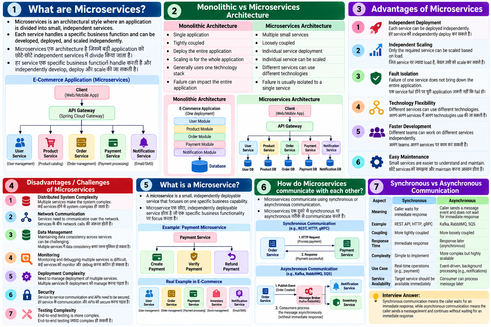
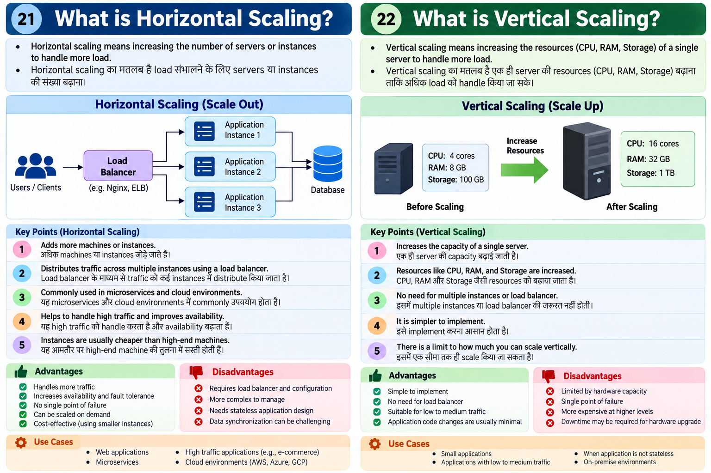
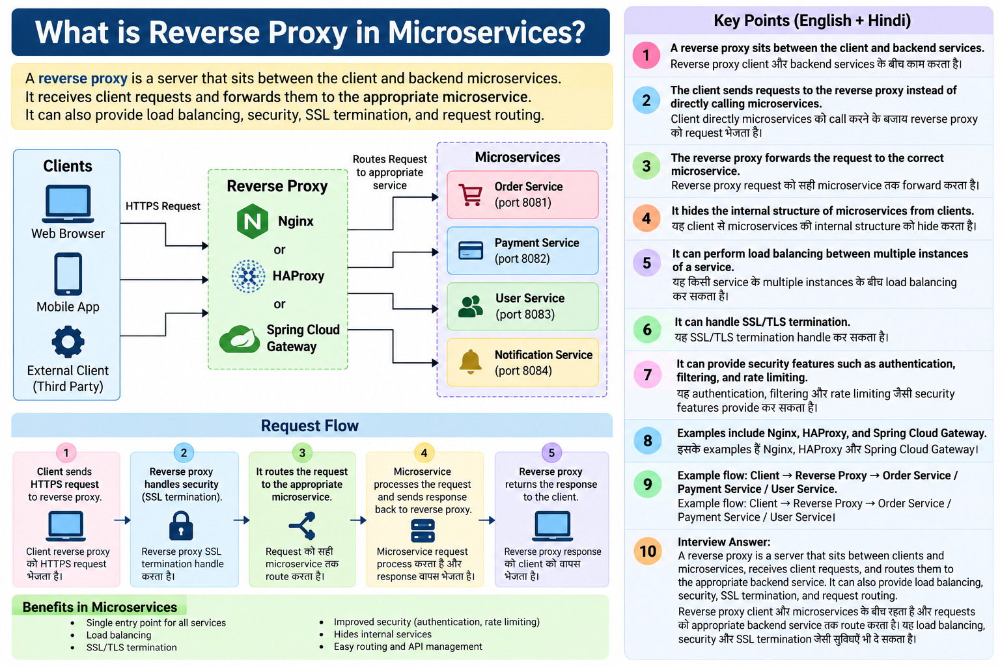

# Microservices Interview Questions — English + Hindi

## 1. What are Microservices?

**English:** Microservices is an architectural style where an application is divided into small, independent services. Each service handles a specific business function and can be developed, deployed, and scaled independently.

**Hindi:** Microservices एक architecture है जिसमें बड़ी application को छोटे-छोटे independent services में divide किया जाता है। हर service एक specific business function handle करती है और independently develop, deploy और scale की जा सकती है।

**Example:**

```text
E-Commerce Application
        |
        +-- User Service
        +-- Order Service
        +-- Payment Service
        +-- Product Service
        +-- Notification Service
```

---

## 2. What is the difference between Monolithic and Microservices Architecture?

| Monolithic                              | Microservices                               |
| --------------------------------------- | ------------------------------------------- |
| एक single application होती है           | Application कई services में divided होती है |
| सभी modules tightly coupled हो सकते हैं | Services loosely coupled होती हैं           |
| पूरा application deploy करना पड़ता है   | Individual service deploy कर सकते हैं       |
| Scaling पूरा application का होता है     | Individual service scale कर सकते हैं        |
| एक technology stack commonly used       | अलग-अलग technology भी use हो सकती हैं       |
| Failure का impact बड़ा हो सकता है       | Failure generally isolated किया जा सकता है  |

**Simple Example:**

```text
Monolithic
     |
     +-- User
     +-- Order
     +-- Payment
     +-- Product
     |
   One Application
```

```text
Microservices

User Service     Order Service
      \             /
       \           /
        API Gateway
       /           \
Payment Service   Product Service
```

---

## 3. What are the Advantages of Microservices?

### Main Advantages:

1. **Independent Deployment**
   एक service को independently deploy कर सकते हैं।

2. **Independent Scaling**
   जिस service पर ज्यादा load है, केवल उसी को scale कर सकते हैं।

3. **Fault Isolation**
   एक service fail होने पर पूरी application जरूरी नहीं कि fail हो।

4. **Technology Flexibility**
   अलग-अलग services में अलग technologies use की जा सकती हैं।

5. **Faster Development**
   अलग teams अलग services पर independently काम कर सकती हैं।

6. **Easy Maintenance**
   छोटे services को समझना और maintain करना comparatively आसान होता है।

**Hindi:** Microservices का मुख्य फायदा है **independent development, deployment, scaling और better fault isolation**।

---

## 4. What are the Disadvantages/Challenges of Microservices?

1. **Distributed System Complexity**
   कई services होने से system complex हो जाता है।

2. **Network Communication**
   Services के बीच network calls की जरूरत होती है।

3. **Data Management**
   Multiple services में data consistency maintain करना challenging हो सकता है।

4. **Monitoring**
   कई services को monitor और debug करना कठिन हो सकता है।

5. **Deployment Complexity**
   Multiple services के deployment को manage करना पड़ता है।

6. **Security**
   हर service के communication और APIs को secure करना पड़ता है।

7. **Testing Complexity**
   End-to-end testing ज्यादा complex हो सकती है।

**Interview Answer:**
Microservices provide scalability and independent deployment, but they also introduce distributed-system complexity, network failures, data-consistency challenges, monitoring, and deployment overhead.

---

## 5. What is a Microservice?

**English:** A microservice is a small, independently deployable service that focuses on one specific business capability.

**Hindi:** Microservice एक छोटा, independently deployable service होता है जो एक specific business functionality पर focus करता है।

**Example:**

```text
Payment Microservice
        |
        +-- Create Payment
        +-- Verify Payment
        +-- Refund Payment
```

**Real Example:**

```text
E-Commerce System

User Service       → User management
Order Service      → Order management
Payment Service    → Payment processing
Inventory Service  → Stock management
Notification       → Email/SMS notifications
```

**Interview Tip:**

> **Microservice = Small + Independent + Business-focused + Independently Deployable**

---

# 6. How do Microservices communicate with each other?

Microservices generally communicate using **synchronous** or **asynchronous** communication.

### A. Synchronous Communication

One service sends a request and **waits for the response**.

Common technologies:

* REST API
* HTTP
* gRPC

```text
Order Service
      |
      | HTTP Request
      ↓
Payment Service
      |
      | Response
      ↓
Order Service
```

**Example:**

```text
Order Service → Payment Service
"Please process payment"

Payment Service → Order Service
"Payment successful"
```

### B. Asynchronous Communication

One service sends a message/event and **does not wait for an immediate response**.

Common technologies:

* Kafka
* RabbitMQ
* Amazon SQS

```text
Order Service
      |
      | OrderCreated Event
      ↓
     Kafka
      |
      +------→ Notification Service
      |
      +------→ Inventory Service
```

---

# 7. What is Synchronous vs Asynchronous Communication?

| Synchronous                                          | Asynchronous                                |
| ---------------------------------------------------- | ------------------------------------------- |
| Request भेजकर response का wait करता है               | Message/event भेजकर wait नहीं करता          |
| Usually immediate response                           | Response बाद में process हो सकता है         |
| REST, HTTP, gRPC                                     | Kafka, RabbitMQ, SQS                        |
| More tightly coupled communication                   | More loosely coupled communication          |
| Simple to understand                                 | More complex but highly scalable            |
| Service availability immediately required हो सकती है | Consumer बाद में message process कर सकता है |

### Easy Example

**Synchronous:**

```text
Order Service
     |
     | "Payment करो"
     ↓
Payment Service
     |
     | "Done"
     ↓
Order Service
```

**Asynchronous:**

```text
Order Service
     |
     | OrderCreated
     ↓
   Kafka
     |
     +----→ Notification Service
     |
     +----→ Inventory Service
```

### 🎯 Interview One-Line Answer

> **Synchronous communication means the caller waits for an immediate response, while asynchronous communication means the caller sends a message/event and continues without waiting for an immediate response.**

>
>
> # REST API & HTTP — Interview Questions

## 8. What is REST API?

**REST = Representational State Transfer**

1. **English:** REST API is an architectural style used to communicate between client and server over HTTP.
   **Hindi:** REST API एक architectural style है जिसका उपयोग client और server के बीच HTTP के द्वारा communication के लिए किया जाता है।

2. **English:** REST APIs use resources such as users, orders, and payments.
   **Hindi:** REST API में User, Order और Payment जैसे resources होते हैं।

3. **English:** Each resource is identified by a URL.
   **Hindi:** हर resource को एक URL से identify किया जाता है।

4. **English:** REST commonly uses HTTP methods such as GET, POST, PUT, PATCH, and DELETE.
   **Hindi:** REST में GET, POST, PUT, PATCH और DELETE जैसे HTTP methods commonly use होते हैं।

5. **English:** REST is generally stateless.
   **Hindi:** REST generally stateless होता है, यानी server client की previous request का session state जरूरी नहीं रखता।

**Example:**

```text
GET    /users          → Get users
GET    /users/101      → Get one user
POST   /users          → Create user
PUT    /users/101      → Update user
DELETE /users/101      → Delete user
```

### Interview Answer

> **REST API is an HTTP-based API style where resources are identified using URLs and accessed using standard HTTP methods.**

---

# 9. What is REST vs SOAP?

| REST                               | SOAP                                  |
| ---------------------------------- | ------------------------------------- |
| Architectural style                | Protocol                              |
| Usually uses HTTP/HTTPS            | Can use HTTP, SMTP, etc.              |
| Commonly uses JSON                 | Commonly uses XML                     |
| Lightweight                        | More heavyweight                      |
| Easy to develop                    | More strict and structured            |
| Common in modern web/microservices | Common in enterprise/legacy systems   |
| Supports HTTP methods              | Uses operations through SOAP messages |
| Generally simpler                  | Generally more complex                |

### Example

**REST:**

```http
GET /users/101
```

```json
{
  "id": 101,
  "name": "Monu"
}
```

**SOAP:**

```xml
<soap:Envelope>
   <soap:Body>
      <getUser>
         <id>101</id>
      </getUser>
   </soap:Body>
</soap:Envelope>
```

**Hindi:**
REST comparatively simple और lightweight approach है, जबकि SOAP एक formal protocol है जिसमें XML-based messaging और strict standards होते हैं।

### Interview Answer

> **REST is an architectural style commonly using HTTP and JSON, while SOAP is a protocol based on structured XML messages and defined standards.**

---

# 10. What are HTTP Methods?

HTTP methods define **what operation we want to perform on a resource**.

| Method      | Purpose                           | Example             |
| ----------- | --------------------------------- | ------------------- |
| **GET**     | Retrieve data                     | `GET /users`        |
| **POST**    | Create data                       | `POST /users`       |
| **PUT**     | Replace/update resource           | `PUT /users/101`    |
| **PATCH**   | Partially update resource         | `PATCH /users/101`  |
| **DELETE**  | Delete resource                   | `DELETE /users/101` |
| **HEAD**    | Get headers without response body | `HEAD /users`       |
| **OPTIONS** | Get supported operations          | `OPTIONS /users`    |

### Easy Explanation

**GET**

```text
GET /users/101
→ User की information चाहिए
```

**POST**

```text
POST /users
→ New user create करना है
```

**PUT**

```text
PUT /users/101
→ Existing user को completely update करना है
```

**PATCH**

```text
PATCH /users/101
→ User की specific field update करनी है
```

**DELETE**

```text
DELETE /users/101
→ User delete करना है
```

### Important Interview Point

**GET, PUT और DELETE are generally idempotent.**
**POST is generally not idempotent.**

**Hindi:** Same idempotent request को multiple times भेजने पर intended final state generally same रहती है।

---

# 11. What are HTTP Status Codes?

HTTP status codes tell us **the result of an HTTP request**.

### 1xx — Informational

Request received and processing continues.

### 2xx — Success

| Code               | Meaning                         | Example           |
| ------------------ | ------------------------------- | ----------------- |
| **200 OK**         | Request successful              | GET successful    |
| **201 Created**    | Resource created                | POST successful   |
| **202 Accepted**   | Request accepted for processing | Async operation   |
| **204 No Content** | Successful but no response body | DELETE successful |

**Hindi:** `2xx` का मतलब request successfully process हुई।

---

### 3xx — Redirection

| Code    | Meaning           |
| ------- | ----------------- |
| **301** | Permanently moved |
| **302** | Temporarily moved |
| **304** | Not modified      |

**Hindi:** `3xx` generally redirection या cached resource से related होता है।

---

### 4xx — Client Error

| Code                       | Meaning                              | Example                   |
| -------------------------- | ------------------------------------ | ------------------------- |
| **400 Bad Request**        | Invalid request                      | Wrong JSON                |
| **401 Unauthorized**       | Authentication required/failed       | Invalid token             |
| **403 Forbidden**          | Access not allowed                   | Insufficient permission   |
| **404 Not Found**          | Resource not found                   | Wrong URL                 |
| **405 Method Not Allowed** | HTTP method not supported            | POST on GET-only endpoint |
| **409 Conflict**           | Request conflicts with current state | Duplicate resource        |
| **429 Too Many Requests**  | Too many requests                    | Rate limit exceeded       |

**Hindi:** `4xx` का मतलब generally client/request side problem है।

---

### 5xx — Server Error

| Code                          | Meaning                                  |
| ----------------------------- | ---------------------------------------- |
| **500 Internal Server Error** | Unexpected server error                  |
| **502 Bad Gateway**           | Gateway received an invalid response     |
| **503 Service Unavailable**   | Service temporarily unavailable          |
| **504 Gateway Timeout**       | Gateway did not receive response in time |

**Hindi:** `5xx` का मतलब generally server या upstream service side problem है।

---

## 🎯 Easy Interview Summary

```text
REST API
   ↓
Communication using HTTP
   ↓
Resources + URLs
   ↓
GET / POST / PUT / PATCH / DELETE
   ↓
HTTP Status Codes
   ↓
2xx → Success
3xx → Redirection
4xx → Client Error
5xx → Server Error
```

### याद रखने की Trick

**HTTP Methods:**

> **GET = Read**
> **POST = Create**
> **PUT = Replace/Update**
> **PATCH = Partial Update**
> **DELETE = Delete**

**Status Codes:**

> **2xx = Success**
> **3xx = Redirect**
> **4xx = Client Error**
> **5xx = Server Error**

# Microservices Interview Questions — English + Hindi

## 1. What is Service Coupling?

**English:** Service coupling means how much one microservice depends on another microservice.

**Hindi:** Service coupling का मतलब है कि एक microservice दूसरी microservice पर कितनी dependent है।

### Example:

```text
Order Service ─────→ Payment Service
       ↑
   Dependency
```

If Order Service cannot work without Payment Service, there is **high coupling**.

**Interview Answer:**

> Coupling is the level of dependency between two services.

---

# 2. What is Loose Coupling?

**English:** Loose coupling means services have **minimum dependency** on each other.

**Hindi:** Loose coupling का मतलब है कि services एक-दूसरे पर **कम से कम dependent** हों।

### Example:

```text
Order Service
      |
      | Event
      ↓
    Kafka
      |
      +----→ Payment Service
      |
      +----→ Notification Service
```

If Payment Service changes internally, Order Service should not need major changes.

### Benefits:

* Easy maintenance
* Independent deployment
* Better scalability
* Better fault isolation

**Interview Answer:**

> Loose coupling allows services to communicate with minimal dependency on each other's internal implementation.

---

# 3. What is Service Autonomy?

**English:** Service autonomy means each microservice can **develop, deploy, scale, and operate independently**.

**Hindi:** Service autonomy का मतलब है कि हर microservice को independently **develop, deploy और scale** किया जा सके।

### Example:

```text
User Service      → User Database
Order Service     → Order Database
Payment Service   → Payment Database
```

Payment Service में change करने के लिए User Service को necessarily change या deploy करने की जरूरत नहीं होनी चाहिए।

### Key Point:

> **Autonomy = Independent ownership + deployment + scaling**

---

# 4. What is Statelessness?

**English:** Statelessness means a service does not store client session state between requests.

**Hindi:** Statelessness का मतलब है कि service client की previous request का session state अपने पास store नहीं करती।

### Example:

```text
Request 1 → Server
Request 2 → Server
Request 3 → Server
```

Each request contains the information required to process it, such as an authentication token.

### In Microservices:

```text
Client
   |
   ↓
Load Balancer
   |
   +----→ Service Instance 1
   |
   +----→ Service Instance 2
   |
   +----→ Service Instance 3
```

Any instance can process the request.

**Interview Answer:**

> A stateless service does not depend on information stored from previous requests on a particular server instance.

---

# 5. Why should Microservices be independently deployable?

**English:** Microservices should be independently deployable so that we can release changes to one service without deploying the entire application.

**Hindi:** Microservices independently deployable होनी चाहिए ताकि एक service में changes करने पर पूरी application को deploy न करना पड़े।

### Example:

```text
Payment Service → New Feature
       ↓
Deploy Payment Service only
       ↓
Other services remain unchanged
```

### Benefits:

1. Faster releases
2. Lower deployment risk
3. Independent scaling
4. Easier rollback
5. Better team productivity

**Interview Answer:**

> Independent deployment allows teams to release, rollback, and scale individual services without affecting the entire application.

---

# 6. What is API Versioning?

**English:** API versioning is the process of maintaining different versions of an API so that changes do not break existing clients.

**Hindi:** API versioning का मतलब API के अलग-अलग versions maintain करना है ताकि नए changes से पुराने clients break न हों।

### Example:

```text
/api/v1/users
/api/v2/users
```

Suppose `v1` has:

```json
{
  "name": "Monu"
}
```

And `v2` introduces:

```json
{
  "firstName": "Monu",
  "lastName": "Shanker"
}
```

Old clients can continue using **v1**, while new clients use **v2**.

### Common Approaches:

```text
URL Versioning
/api/v1/users

Header Versioning
X-API-Version: 2

Query Parameter
/api/users?version=2
```

**Interview Answer:**

> API versioning allows us to introduce API changes while maintaining backward compatibility with existing clients.

---

# 7. What is JSON?

**JSON = JavaScript Object Notation**

**English:** JSON is a lightweight data-interchange format commonly used for communication between clients and REST APIs.

**Hindi:** JSON एक lightweight data format है जिसका उपयोग client और REST API के बीच data exchange करने के लिए commonly किया जाता है।

### Example:

```json
{
  "id": 101,
  "name": "Monu",
  "role": "Java Developer"
}
```

### Features:

* Easy to read
* Lightweight
* Human-readable
* Supports objects and arrays
* Commonly used with REST APIs

**Interview Answer:**

> JSON is a lightweight, human-readable format used to exchange structured data between systems.

---

# 8. What is Serialization and Deserialization?

## Serialization

**English:** Serialization converts an object into a format that can be stored or transmitted, such as JSON.

**Hindi:** Serialization में Java object को JSON या किसी दूसरे transferable format में convert किया जाता है।

```text
Java Object
     ↓
Serialization
     ↓
JSON
```

### Example:

```java
User user = new User(101, "Monu");
```

↓

```json
{
  "id": 101,
  "name": "Monu"
}
```

---

## Deserialization

**English:** Deserialization converts the received data back into an object.

**Hindi:** Deserialization में JSON या received data को वापस Java object में convert किया जाता है।

```text
JSON
  ↓
Deserialization
  ↓
Java Object
```

### Easy Trick:

> **Serialization = Object → JSON**
> **Deserialization = JSON → Object**

### Spring Boot Example:

```java
@PostMapping("/users")
public User createUser(@RequestBody User user) {
    return user;
}
```

Here, Spring/Jackson converts the incoming JSON into a `User` object through **deserialization**.

---

# 9. What is Idempotency?

**English:** An operation is idempotent if performing the same request multiple times produces the **same intended final result** as performing it once.

**Hindi:** Idempotency का मतलब है कि same request को multiple times execute करने पर intended final state वही रहती है जो एक बार execute करने पर रहती है।

### Example — PUT

```http
PUT /users/101
```

```json
{
  "name": "Monu"
}
```

Send it once:

```text
User 101 → name = Monu
```

Send it 5 times:

```text
User 101 → name = Monu
```

Final state remains the same.

### Non-Idempotent Example — POST

```http
POST /payments
```

If the same payment request is sent multiple times, it could potentially create multiple payment transactions.

---

## Idempotency in Payment Microservices

This is **very important for payment systems**.

Client sends:

```http
POST /payments
Idempotency-Key: PAY12345
```

If the client retries the same request:

```text
Request 1 → PAY12345 → Payment created
Request 2 → PAY12345 → Existing result returned
Request 3 → PAY12345 → Existing result returned
```

This helps prevent **duplicate payments**.

### Simple Flow:

```text
Client
  |
  | Payment + Idempotency-Key
  ↓
Payment Service
  |
  ↓
Check Idempotency Key
  |
  +---- Key exists → Return previous result
  |
  +---- Key doesn't exist → Process payment
                         ↓
                    Save result
```

### Interview Answer:

> **Idempotency means repeating the same request does not create an unintended additional effect. It is especially important in payment systems to prevent duplicate transactions.**

---

## 🎯 Quick Revision

| Topic                      | Easy Meaning                                 |
| -------------------------- | -------------------------------------------- |
| **Service Coupling**       | Dependency between services                  |
| **Loose Coupling**         | Minimum dependency                           |
| **Service Autonomy**       | Services work independently                  |
| **Statelessness**          | No server-side request/session dependency    |
| **Independent Deployment** | Deploy one service without deploying all     |
| **API Versioning**         | Maintain API versions                        |
| **JSON**                   | Data exchange format                         |
| **Serialization**          | Object → JSON                                |
| **Deserialization**        | JSON → Object                                |
| **Idempotency**            | Repeated request → same intended final state |



